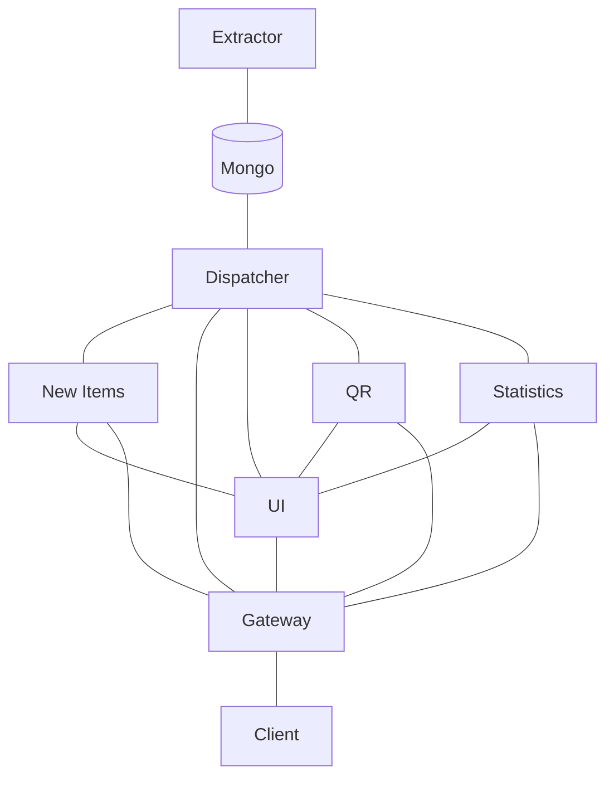

# [Multimo](https://multimo.ml)

Authors: [Urša Keše](https://github.com/ukese),
[Erazem Kokot](https://github.com/erazemk) and
[Miha Krumpestar](https://github.com/mk2376).

Multimo is a grocery item price tracker with some added extra features.
With so many stores and inadequate support to navigate the prices,
we came up with a website where you will be presented with incredible
data visualizations that will help you to make better and more conscious
shopping decisions.

Check out the demo at [multimo.ml](https://multimo.ml).

## Architecture

### Microservices and features

UI (`multimo.ml`):
- Main app, uses SSG, so it runs as a separate microservice

Extractor (`/extractor`):
- Extracts data from stores and stores it in the database
- Endpoints:
  - `/self`: Health check
  - `/v1/info`: Server internal state
  - `/v1/extract`: Manually starts extraction

Dispatcher (`/products`):
- Returns product info from the database
- Endpoints:
  - `/live`: Liveliness check
  - `/ready`: Readiness check
  - `/v1/all`: Returns a list of all products

QR Generator (`/qr`):
- Generates QR codes for products
- Endpoints:
  - `/live`: Liveliness check
  - `/ready`: Readiness check
  - `/generate`: Generates a QR code for a product

Statistics (`/stats`):
- Returns statistics about Multimo and products
- Endpoints:
  - `/all`: Returns all statistics about products

Tracker (`/new`):
- Tracks new products
- Endpoints:
  - `/v1/products`: Returns a list of new products

## License

Multimo is licensed under the [GNU AGPLv3 license](LICENSE).
