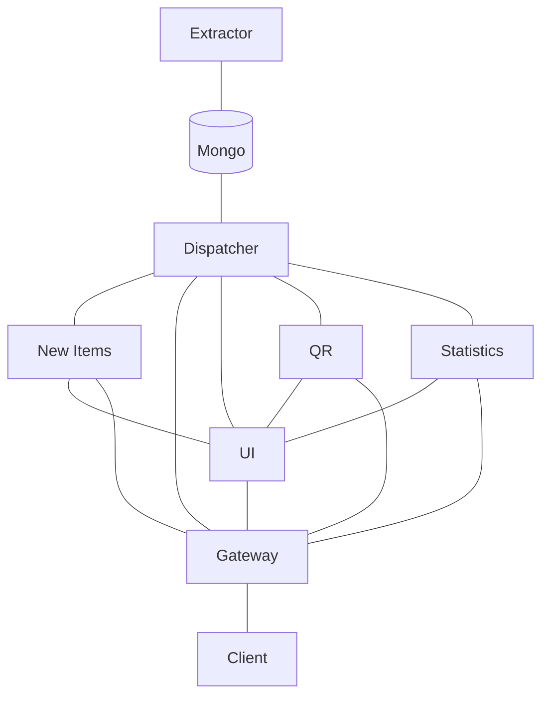

# [Multimo](https://multimo.ml)

## About

Multimo is a grocery item price tracker with some added extra features.
With so many stores and inadequate support to navigate the prices,
we came up with a website where you will be presented with incredible
data visualizations that will help you to make better and more conscious
shopping decisions.

It was developed by [Urša Keše](https://github.com/ukese),
[Erazem Kokot](https://github.com/erazemk) and
[Miha Krumpestar](https://github.com/mk2376).

Urša and Miha used VSCode to develop the project, while Erazem used GoLand.

All repositories are visible in the organization, and each repository
has a package (Docker image) associated with it, which can also be found on
the right side of the page, when viewing the repository.

Check out the demo at [multimo.ml](https://multimo.ml).

## Architecture

Most microservices and the client communicate over REST APIs (the UI uses
async REST calls), while the dispatcher and our in-house developed dynamic configuration service
communicate over gRPC.

## Microservices and features

### UI (`multimo.ml`)
- Main app, uses SSG, so it runs as a separate microservice

### Extractor (`/extractor`)
- Extracts data from stores and stores it in the database
- Available endpoints:
  - [`/self`](https://multimo.ml/extractor/self): Liveliness and readiness check
  - [`/v1/info`](https://multimo.ml/extractor/v1/info): Returns internal state of extractor
  - [`/v1/extract`](https://multimo.ml/extractor/v1/extract): Signals extractor to initiate a new extraction

### Dispatcher (`/products`)
- Returns product info from the database
- Available endpoints:
  - [`/live`](https://multimo.ml/products/live): Liveliness check
  - [`/ready`](https://multimo.ml/products/ready): Readiness check
  - [`/v1/all`](https://multimo.ml/products/v1/all): Returns a list of all products
  - [`/v1/:id`](https://multimo.ml/products/v1/000000000000000000567522): Returns a single product by id
- Available query parameters:
  - [`limit`](https://multimo.ml/products/v1/all?limit=3): The number of returned products
  - [`offset`](https://multimo.ml/products/v1/all?limit=3&offset=5): Which product to start from
  - [`sort`](https://multimo.ml/products/v1/all?limit=3&sort=price): Sort by field (none, name, price, category)
  - [`order`](https://multimo.ml/products/v1/all?limit=3&sort=name&order=desc): Sort order (asc, desc)
  - [`history`](https://multimo.ml/products/v1/all?limit=1&history=full): Limit number of prices to display per item (last, none, all)
  - [`category`](https://multimo.ml/products/v1/all?limit=3&category=Olives): Filter by category name

### QR Generator (`/qr`):
- Generates QR codes for products
- Available endpoints:
  - [`/live`](https://multimo.ml/qr/live): Liveliness check
  - [`/ready`](https://multimo.ml/qr/ready): Readiness check
  - [`/v1/:id`](https://multimo.ml/qr/v1/:id): Generates a QR code for a product

Statistics (`/stats`):
- Returns statistics about Multimo and products
- Available endpoints:
  - [`/live`](https://multimo.ml/stats/live): Liveliness check
  - [`/ready`](https://multimo.ml/stats/ready): Readiness check
  - [`/v1/all`](https://multimo.ml/stats/v1/all): Returns all statistics

Tracker (`/new`):
- Tracks new products
- Available endpoints:
  - [`/live`](https://multimo.ml/tracker/live): Liveliness check
  - [`/ready`](https://multimo.ml/tracker/ready): Readiness check
  - [`/v1/new`](https://multimo.ml/tracker/v1/new): Returns a list of all new products

## Use cases

- User wants to see the price of a product
  - User enters the product name in the search bar
  - User selects the product from the list
  - User is presented with a list of items
  - User can select an item to see the price history
- User wants to share an item with a friend
  - User enters the product name in the search bar
  - User selects the product from the list
  - User can scan the QR code to share the product with a friend

## Infrastructure

We built our Docker images automatically using GitHub Actions,
pushed them to Github's container registry and then (as part of the
action workflow) also deployed them to our Kubernetes cluster, which
is hosted on DigitalOcean.
The application is available at [multimo.ml](https://multimo.ml)
and all endpoints mentioned in this document should be clickable and
available to use.

## Configuration

Our microservices support multiple levels of configuration,
starting from the default values, which are defined in the code,
reading from environment variables, reading from a configuration file
and finally reading values from our in-house developed dynamic configuration
service (whose source code is available in [the shared repo](https://github.com/MultimoML/shared/tree/main/etcd)).

## Monitoring, logging and metrics

Each of our microservices exposes a `/live` and `/ready` endpoint,
which use various checks to determine if the service is alive and
ready to serve requests (e.g. checking the status of the database or
a connection to another service).

We use Datadog for our log and metrics collection and monitoring.
It is able to get in-depth information about the cluster, such as
the number of running pods, the number of requests per second, the
number of errors, the CPU and memory usage, etc., which is comparable
to Kubernetes' built-in metrics.

## External APIs

- [QR Code Generator](https://goqr.me/api)
  - Used for generating QR codes from data
- [Spar's undocumented API](https://www.spar.si/)
  - Used by the extractor to get product data from Spar

## Documenting OpenAPI endpoints

All our microservices follow the OpenAPI specification and expose
their endpoints at `/openapi`.
We used the `swagger-gin` library to generate the OpenAPI specification.

## Fault tolerance

Through the use of our dynamic configuration service, we can easily
fake a dead status of a microservice, to show that Kubernetes will
automatically restart the service and that it will be able to serve
requests again.

We pass this signal to the microservices through the use of our dynamic
configuration service, using a key called `broken`.

The list of currently available configuration keys can be found on
[http://multimo.dedyn.io:30000/](http://multimo.dedyn.io:30000/).
The status of the `broken` key can be found on [`/broken`](http://multimo.dedyn.io:30000/broken).

The configuration is stored as simple key:value pairs.

## License

Multimo is licensed under the [GNU AGPLv3 license](LICENSE).
