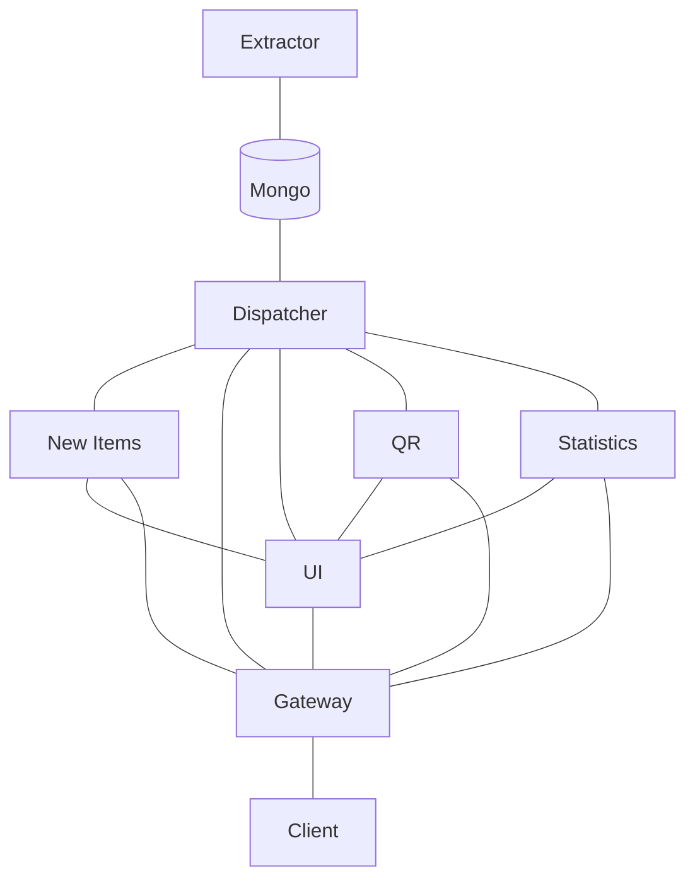

```mermaid
flowchart TB
 %%{init: { 'theme': 'dark'}%%

    extractor[Extractor] --- mongoDB[(Mongo)]
    mongoDB --- dispatcher[Dispatcher]
    dispatcher --- newItems[New Items]
    dispatcher --- gateway[Gateway]
    dispatcher --- ui[UI]
    dispatcher --- qr[QR]
    dispatcher --- stat[Statistics]
    newItems --- ui
    gateway --- client[Client]
    ui --- gateway
    qr --- ui
    qr --- gateway
    newItems --- gateway
    stat --- ui
    stat --- gateway
    click extractor https://github.com/MultimoML/extractor
    click qr https://github.com/MultimoML/qr-generator
    click ui https://github.com/MultimoML/ui
    click dispatcher https://github.com/MultimoML/dispatcher
    click stat https://github.com/MultimoML/statistics
    click newItems https://github.com/MultimoML/newItems
    linkStyle default stroke-width:0.7px;
```
